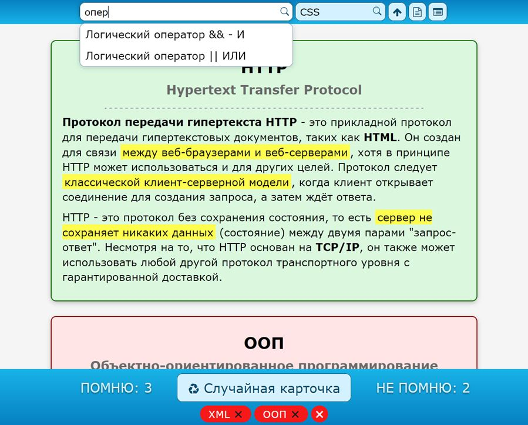

# Self Test

SPA проект для самотестирования и помощи в изучении, разработанный с использованием HTML, CSS, JavaScript и React ([ссылка](https://devmikealex.github.io/Self-Test/)). Представляет из себя набор терминов и технологий в области веб-разработки и основы программирования JavaScript. Пользователь выбирает показать случайную карточку с информацией и, видя лишь заголовок, самостоятельно принимает решение, насколько хорошо он помнит описание.



## Возможности

Отрицательные ответы хранятся в **localStorage** браузера между сессиями. Доступен поиск по названию и служебный поиск для разработчика по имени файла с исходниками.

Данные загружаются с http сервера в виде обычного файла c готовым HTML форматированием и помещаются на страницу. Поэтому проект не работает при открытии в браузере локального файла `index.html`.

### Подпроекты

- **Server** - простой тестовый сервер на **express** для запуска проекта из папки **build** [http://127.0.0.1:3000/build/index.html](http://127.0.0.1:3000/build/index.html)

- **DATA conversion** - Формирование общего вспомогательного файла данных `collection.json`. Проект считывает все файлы *.html из основной директории **data**, игнорируя те, что начинаются с "_", и создает массив с перечислением для доступа приложению. Каждая запись состоит из адреса, информации для поиска и названия.

```json
  {
    "alias": "CSS",
    "search": "cascading style sheets css каскадные таблицы стилей",
    "title": "CSS"
  }
```

При создании записи для поиска из полей удаляются дубликаты и короткие слова до 3-х букв. Кроме слов, перечисленных во второй строке конкретного файла.

### Структура файла данных

Пустые строки в файле игнорируются, кроме тега `<pre>` в теле основной информации.

`1 строка` - Название
`2 строка` - Информация для поиска
`3 строка` - %% признак-разделитель дополнительной информации в следующей строка
`4 строка` - Дополнительная информация (опционально)
`...` - Основная информация
`%%` - Разделитель
`...` - Дополнительные ссылки в виде название + ссылка (две строки). Ссылки на **YouTube** видео преобразуются в картинки с превью.

## Дополнительные команды

- Обновленная команда **build** для запуска проекта из любой папки сервера (вместо корня по умолчанию) с помощь изменения переменной окружения `PUBLIC_URL` [источник](https://stackoverflow.com/questions/49429906/how-should-i-configure-create-react-app-to-serve-app-from-subdirectory):

```json
"build": "set PUBLIC_URL=.&& react-scripts build"
```

- Запуск тестового сервера для папки **build**:

```json
"serv": "serve build"
```

- Загрузка папки **build** на GitHub в ветку **gh-pages** для [demo](https://devmikealex.github.io/Self-Test/) версии с помощью **push-dir**:

```json
"deploy": "push-dir --dir=build --branch=gh-pages"
```

## Дополнительные изменения

### Модификация webpackDevServer

Чтобы сервер разработки команды **react-scripts start** перестал всегда выдавать основную страницу в случае ошибки 404, в файле `\node_modules\react-scripts\config\webpackDevServer.config.js` выключаем параметр `historyApiFallback: false`. [источник](https://webpack.js.org/configuration/dev-server/#devserverhistoryapifallback)
